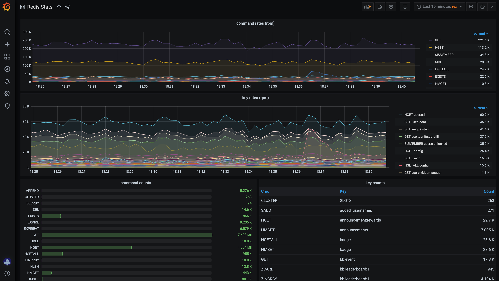

# redis-traffic-stats

`redis-traffic-stats` is a live monitor and analyze RESP packets in your server. This tool does not touch Redis Server.  Just monitors redis client request and response on the real time.

All redis stats exported as prometheus metrics so you can visualize analytics data on your favorite dashboard (like grafana).

Features:

* Live Monitoring
* Low CPU utilization
* Prometheus Exporter
* Basic-Auth protection
* Top commands of count
* Top command and keys count
* No dependencies
* No Redis performance degradation



### Tasks:

- [x] Count commands and arguments  
- [ ] Count network traffic of command
- [ ] Monitor Slow commands
- [ ] Monitor big response

## Installation

* [redis-traffic-stats_linux_amd64](https://github.com/c1982/redis-traffic-stats/releases/download/v1.0.0/redis-traffic-stats_linux_amd64) 

## Usage

```bash
./redis-traffic-stats --interface=ens5 --addr=:9200 \
--password=pass \
--debug=false \
-s=: \
-r="[0-9a-fA-F]{8}\-[0-9a-fA-F]{4}\-[0-9a-fA-F]{4}\-[0-9a-fA-F]{4}\-[0-9a-fA-F]{12}" \
--redisport=6379 \
--max=150
```

Flag | Default | Usage
--- | --- | ---
debug | false | Enable debug logs
interface | empty | Ethernet infreface name. eth0, ens5
redisport | 6379 | Redis server port number
addr | :9200 | http listener port for prometheus metrics
username | admin | Prometheus metrics username
password | **** | Prometheus metrics password
s | empty | Separator of keys (for split). If it empty does not split keys.
r | empty | Regex pattern of keys (for clean)
max | 150 | Maximum lookup size of key. If value -1 unlimited lookup. 

### Grafana Dashboard

This easy way for dasboarding. You can upload to grafana [this](./grafana-dashboard.json) file.

### Static Compilation

This tool require libpcap library (https://www.tcpdump.org/). 
You can embed dependencies on the compilation process. This helps for portability.
Check the build command below

```bash
LDFLAGS='-l/usr/lib/libpcap.a' CGO_ENABLED=1 go build -ldflags '-linkmode external -extldflags -static' .
```

### Troubleshooting

If you get an error about libpcap like below

```bash
./redis-traffic-stats: error while loading shared libraries: libpcap.so.0.8: cannot open shared object file: No such file or directory
```

install libpcap

for centos
>yum install libpcap-devel

## License

Distributed under the MIT License. See `LICENSE` for more information.

## Contact

Oğuzhan YILMAZ - [@c1982](https://twitter.com/c1982) - aspsrc@gmail.com